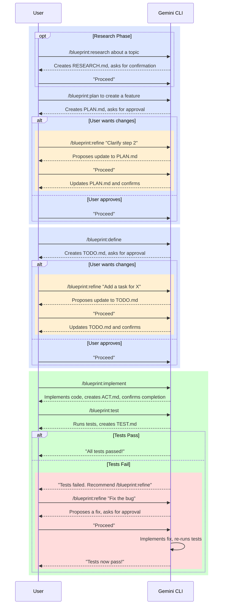

# Gemini CLI Blueprint Extension

This extension provides a collection of commands giving you a structured and robust workflow for tackling complex software engineering tasks directly within Gemini CLI.

This workflow is designed to guide you from the initial research and planning stages all the way through implementation, following a PLAN --> DEFINE --> ACT loop.

## Core Concepts

The workflow is built around a few core ideas:

*   **Step-by-Step Process:** Each command corresponds to a specific phase of a development task. You move from one step to the next, with each command building on the output of the last.
*   **Stateful Tracking:** The workflow uses a series of markdown files (e.g., `PLAN.md`, `TODO.md`, `ACT.md`) to track the state of your task. This allows you to pause and resume your work without losing context.
*   **User Approval:** The workflow emphasizes safety and collaboration. For any significant action, such as creating a plan or fixing a bug, Gemini will present its proposed changes for your approval before proceeding.

## The Workflow

The typical workflow follows this sequence:

1.  **/blueprint:research**: Gather initial information and context.
2.  **/blueprint:plan**: Create a high-level, step-by-step plan.
3.  **/blueprint:define**: Break the plan down into a detailed `TODO.md` list.
4.  **/blueprint:implement**: Execute the tasks in the `TODO.md` list.
5.  **/blueprint:test**: Verify the implementation against the plan.

**Optional:**

*   **/blueprint:refine**: Iterate on any part of the workflow based on test results or your feedback.

## Workflow Diagram



## Commands

This extension provides the following commands:

*   **/blueprint:research**: Searches for information on a topic.
*   **/blueprint:plan**: Creates a plan to accomplish your goal.
*   **/blueprint:define**: For the given plan, defines the specific tasks to achieve the goal.
*   **/blueprint:implement**: Implements a plan by executing defined tasks.
*   **/blueprint:test**: Tests the plan's implementation to verify it meets the requirements.
*   **/blueprint:refine**: Refines any part of the workflow based on user feedback or test failures.

### Utility Commands

*   **/blueprint:resume**: Resumes an interrupted workflow by automatically determining the last completed step.
*   **/blueprint:clear**: Clears the workspace of all workflow-generated markdown files.

## Getting Started

To start a new task, simply invoke the first command in the workflow that makes sense for your needs. For a brand new feature, you might start with `/blueprint:research` or, more commonly, `/blueprint:plan`.

```
/blueprint:plan add a new authentication endpoint
```

Gemini will then guide you through the subsequent steps. If you get interrupted, you can always come back and run `/blueprint:resume` to pick up right where you left off.